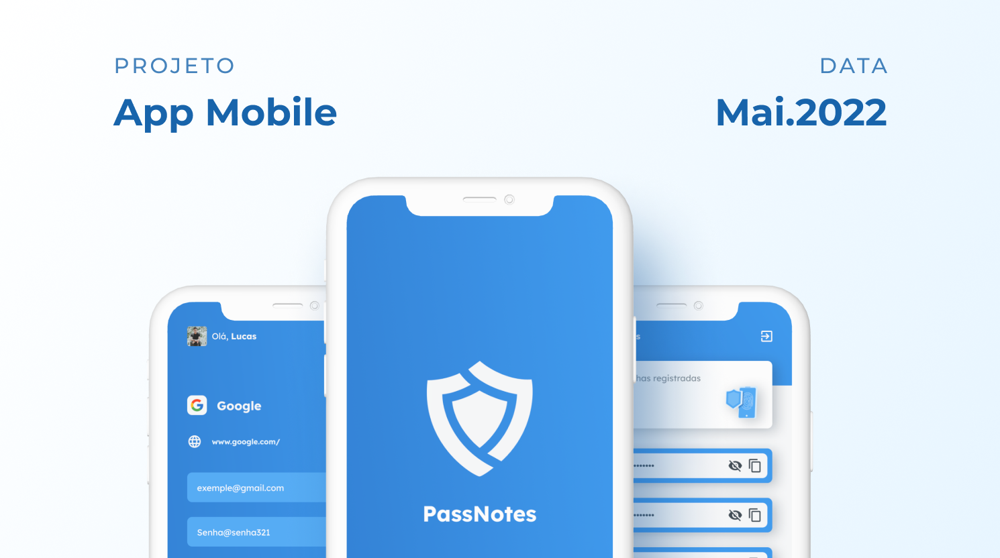

# PassNotes

Aplicativo de gerenciamento de senhas em armazenamento local. Este aplicativo foi criado para fins de estudos.

## Layout

https://www.figma.com/file/LhxLub4BpSZKHuX2gmJutK/PassNotes?node-id=1%3A2

## Tecnologias

- React Native
- Typescript
- Async Storage
- Firebase Authentication
- Firenbase Firestore
- App Distribuition
